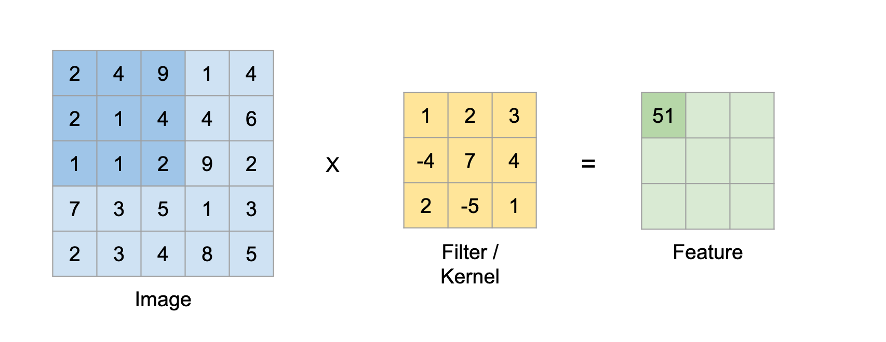

**PROJECT SPECIFICATION \- Project (Technical Computing) 2022/23**

| Student:  | Richard William Atkinson |
| ----- | :---- |
| **Date:**  | **16/01/23** |
| **Supervisor:**  | **Rashad, Rizwana** |
| **Degree Course:**  | **BSc Computer Science** |
| **Title of Project:**  | **Evaluating different machine learning algorithms and their effectiveness in detecting and diagnosing glaucoma.** |

#### **BCS Code of Conduct**

| I confirm that I have successfully completed the BCS code of conduct on-line test with a mark of 70% or above. This is a condition of completing the Project (Technical Computing) module. Signature: Richard William Atkinson  |
| :---- |

#### **Publication of Work**

| I confirm that I understand the "Guidance on Publication Procedures" as described on the Bb site for the module. Signature: Richard William Atkinson |
|:-----------------------------------------------------------------------------------------------------------------------------------------------------|

#### **GDPR (General Data Protection Regulation)**

| I confirm that I will use the "Participant Information Sheet" as a basis for any survey, questionnaire, or participant testing materials. The participant information sheet form is available on the Bb site for the module and as an appendix in the handbook. Signature: Richard William Atkinson |
|:----------------------------------------------------------------------------------------------------------------------------------------------------------------------------------------------------------------------------------------------------------------------------------------------------|

#### 

#### 

#### 

[BCS Code of Conduct](#heading=)

[Publication of Work](#heading=)

[GDPR (General Data Protection Regulation)](#heading=)

[Introduction](#introduction)

[What is Glaucoma](#what-is-glaucoma)

[What is meant by AI and ML](#what-is-meant-by-ai-and-ml)

[Motivations](#motivations)

[Project Aims](#project-aims)

[Research](#research)

[Existing work](#existing-work)

[What is image classification](#what-is-image-classification)

[What is image segmentation](#what-is-image-segmentation)

[Image mask](#image-mask)

[Fundamentals Machine Learning Concepts](#fundamentals-machine-learning-concepts)

[Optimisation Algorithms](#optimisation-algorithms)

[Loss Function](#loss-function)

[Machine Learning Algorithms](#machine-learning-algorithms)

[ANN](#ann)

[CNN](#cnn)

[Network Architectures](#network-architectures)

[U-Net](#u-net)

[PyramidNet](#pyramidnet)

[Conclusion](#conclusion)

[Design](#design)

[Datasets](#datasets)

[Functionality](#functionality)

[Language](#language)

[Frameworks](#frameworks)

[Development Environment and Package Manager](#development-environment-and-package-manager)

[Hardware Requirements and Software Dependencies](#hardware-requirements-and-software-dependencies)

[Development](#development)

[Feasibility](#feasibility)

[Development methodology](#development-methodology)

[Training The Models](#training-the-models)

[Testing](#testing)

[PAPILA Dataset](#papila-dataset)

[REFUGE Dataset](#refuge-dataset)

[Average Results](#average-results)

[Summary](#summary)

[Conclusion](#conclusion-1)

[Critical Reflection](#critical-reflection)

[Ethics](#ethics)

[Evaluating success](#evaluating-success)

[Future Developments](#future-developments)

[Personal Development](#personal-development)

[Bibliography](#bibliography)

## 

## Acknowledgements

In this section before we go into depth about my Final year project I’d like to take the time to personally thank some of the people who helped me do the best that I could and be the best that I could.

My primary project supervisor, Rizwana Rashad, was vital in helping me decide what topic I wanted to do for my final year project. They did this not by just offering suggestions on topics but by taking the time over multiple days to discuss my interests and aspirations thereby guiding me to the topic that was of importance to me and I found very interesting. I do not consider it an exaggeration to say They helped shape what project I intended to do. 

It didn't stop there. Over the course of writing my project specification they read through it and offered suggestions on how to improve my plan and create the best project I could. 

My secondary project supervisor Oram, Adrian also helped by providing feedback on my project specification and ethics form. This was a great confidence boost and helped me redouble my efforts in building the software I had laid out.

Finally, I’d like to talk about my family, specifically my late grandmother who was one of the reasons I thought about glaucoma in the first place. My grandmother was one of the biggest reasons I even decided to go to university after I finished my A levels and it was people like her who always helped me strive to be the best person I could possibly be.

## 

## Introduction {#introduction}

### What is Glaucoma {#what-is-glaucoma}

  
  
This image is annotated by me and is from the PAPILA dataset more information on the data set can be found here [https://www.nature.com/articles/s41597-022-01388-1](https://www.nature.com/articles/s41597-022-01388-1)

Firstly I'm going to describe a couple of terms to bring everyone onto the same page. A fundus image, is a specialised type of medical image that captures the interior surface of the eye, specifically the back part of the eye called the fundus. The fundus includes the retina, optic disc and cup, blood vessels, and other structures that can provide valuable information about the health and condition of the eye. The process of taking one is non-invasive and the process is quick.

Secondly, what is Glaucoma? “Glaucoma is a chronic  common eye condition where the optic nerve, which connects the eye to the brain, becomes damaged.”\[2\] the process is gradual but irreversible if left untreated. The damage is caused by increased pressure in the eye which damages the optic nerve. This can be identified by observing the cup-to-disc ratio which is better described by how much of the optic disc is covered by the optic cup with a higher number being more dangerous. 

 

### What is meant by AI and ML {#what-is-meant-by-ai-and-ml}

The term AI means different things to different people for instance “the designing and building of intelligent agents that receive precepts from the environment and take actions that affect that environment” is how Stuart Russell and Peter Norvig talk about AI in “Artificial Intelligence: A Modern Approach” but the term has been around far longer than this book my research indicates the first use of the term being during the second Dartmouth conference organised in 1956\[1\]. So while I could argue the definition that is not the purpose of my research but so everyone is on the same page, AI in my opinion is a computer's ability to perform and complete a task that would require a human's intelligence. 

Now I want to talk about Machine Learning. This is a term that occasionally even the most astute can conflate with AI but they are not the same. Machine learning is a subset of AI that involves the development of models that enable computer systems to automatically learn from and make predictions based on data without being explicitly programmed to perform the given task. 

### Motivations {#motivations}

This section serves no technical purpose but I would like to discuss why I chose this specific condition for my project. Earlier I explained what glaucoma was and what happens when it is left untreated my goal in creating this is not to replace opticians in performing optic nerve assessments but instead to provide them with a tool that can be used to help prevent misdiagnosis and to ensure people don’t suffer from the effects of glaucoma. 

There is also a personal component to be clear my grandmother and my brother have been diagnosed with glaucoma and that means that I'm more likely to develop the condition myself.\[16\] There is the fact that my grandmother spent a long time being misdiagnosed and not being treated for her glaucoma which resulted in the degradation and loss of her peripheral vision. The goal of what I'm doing here is to prove that there using AI and ML we can reduce the number of people who lose part of their vision.

### Project Aims {#project-aims}

This project will have a desktop app that you can use to process a fundus image that you have saved locally and use it to detect whether or not a patient has or doesn't have glaucoma. The project should run on affordable modern hardware as of 2023\.  
 

## Research {#research}

### Existing work {#existing-work}

My research indicates that there exists no solution to this problem that is used in the field of ophthalmology yet. Many research papers on the other hand explore the idea of using machine learning to detect glaucoma.

Deep learning on fundus images detects glaucoma beyond the optic disc\[3\] is a research paper that shows how we can use image classification on fundus images to detect the damage caused by glaucoma and diagnose it accurately. This differs from my work because I will be using image segmentation to extract the cup-to-disc ratio and be using but it serves to demonstrate that machine learning techniques can and have been used on this problem and have shown great results. 

### What is image classification {#what-is-image-classification}

is a computer vision task that involves assigning predefined categories or “labels” to images based on their pixel values. It is a form of supervised machine learning, where an algorithm is trained on a labelled dataset containing images with known categories, and then used to classify new, unseen images into those categories\[5\].

“Advancing analytics”\[4\] talks about how image classification can be damaged by an imbalanced data set. All the data sets for the task that I have seen show a massive disparity between the number of healthy and ill patients.  Another issue with image classification is when there are varying light levels or any other interference with the image so pre-processing steps must be added to remove these issues.

### What is image segmentation {#what-is-image-segmentation}

Image segmentation is where the image is separated into multiple image segments, the goal being to simplify the image into something more meaningful or easier to recognise\[6\]. Image segmentation is normally very expensive to do so models will take longer to train and run so this is something that needs to be considered when creating the solution.

#### Image mask {#image-mask}

Masks in the context of image segmentation are images where objects are separated from the background and reduced to their “silhouette”. Here are some examples.  
  \[7\]  
This is an example of a binary mask. In this image the flower petals are white and the background is white. One use of this is by only including the corresponding pixels of the original image that are white in the mask you can extract only the flower petals from the original image.  
  \[7\]  
Image segmentation can also be used to generate masks with multiple objects and not just one in this case rather than black and white the image is a black background and a different colour for each distinct object here is an example of that.  
   \[8\]

### Fundamentals Machine Learning Concepts {#fundamentals-machine-learning-concepts}

Machine learning is a complicated topic I can only briefly review in this section. I believe there are 4 key components to machine learning and I intend to review them here.

#### Optimisation Algorithms {#optimisation-algorithms}

Optimization algorithms are mathematical equations designed to find the best possible solution for a given problem, often referred to as minimising the "loss function." The energy function E(c) is defined as the sum of Φa(c) and Φb(c, c'), where C represents the label for a given region (e.g., 0 for background, 1 for the optic disc, and 2 for optic cup), C' is the label of the neighbouring pixel, and Φa(c) and Φb(c, c') are functions that measure dissimilarity between pixels, such as colour or label.

E(c) \= ∑ Φa(c) \+ ∑ Φb(c, c')

To minimise the energy function, a directed graph is constructed using the image as a grid of nodes, where each node represents a pixel and each edge represents the relationship between two pixels, calculated by the term Φb(X, X'). An optimization algorithm is then used to minimise the energy function, which involves minimising the sum of Φa(c) and Φb(c, c') over all pixels in the image.

Various optimization algorithms can be used for this purpose, and the choice of the right one depends on experimentation and the specific requirements of the problem. When training a machine learning model, the frequency of using the optimization algorithm can affect the model's performance.

This is just one of many optimisation algorithms that can be used for a problem and the right one for any given problem can only be found from experimentation. 

When training a Machine Learning model the frequency of how often the optimisation algorithm is used affects the performance of the trained model. There are a couple of accepted methods and I'd like to go over some of their drawbacks and benefits here. 

Batch Gradient Descent (BGD) updates the model parameters after each epoch, making it suitable for small datasets that fit in memory. However, it can get stuck in local minimums, limiting its ability to find the optimal solution.

Stochastic Gradient Descent (SGD) updates the model parameters for every data point, making it suitable for very large datasets where only a small part fits into memory. However, frequent updates can make it slower to converge to the optimal solution.

Mini-Batch Gradient Descent (mBGD) is a compromise between BGD and SGD, as it updates the model parameters after a predefined number of data points. It combines the advantages and drawbacks of both methods and allows for tuning the batch size to find an optimal solution.

#### Loss Function  {#loss-function}

Loss functions are a very simple concept. It is a mathematical equation used to calculate the difference between the real value of the data and the predicted value by the model. An example loss function is dice loss.

Dice Loss \= 1 \- (2 \* (|X ∩ Y| \+ ε)) / (|X| \+ |Y| \+ ε)  
The way this equation works is quite simple if you break it down. First, the equation counts the number of common pixels between the actual result and the predicted result and uses that to calculate the ratio of correct predictions and the number of pixels in the image. The constant ε is a very small constant just used to prevent a situation where the equation might divide by zero.

#### Machine Learning Algorithms {#machine-learning-algorithms}

There are two parts of Machine learning Algorithms that I’d like to discuss in this section first I’d like to talk about basic neural network architectures such as ANN and CNNs then I’d like to begin exploring more advanced architectures like 

##### ANN {#ann}

An Artificial neural network is a deep learning architecture based on the concept of the perceptron. The easiest way to describe ANNs is that they are inspired by the human brain, that is to say, at their core ANNs are composed of interconnected nodes called “neurons”; these neurons are structured into layers. The neurons in each layer process the data they receive from the previous layer via “activation functions”.  
    \[9\]  
Above is an example of the ANN architecture but it should be known that there can be any amount of “hidden layers” which are the layers between the input and output layers. ANNs are typically feed forward which means that every neuron is connected to every neuron in the previous layer below is a diagram for how the value of a neuron is calculated

  \[10\]  
The value in this diagram called weights changes throughout the model's training via a combination of the optimisation algorithm and loss function. The training process itself can be broken down into a four-step process.   
1\. The forward pass during this section the input data is passed to the model each neuron's value is calculated according to the above diagram and passed forward until the output layer. 2\. The error value or more simply the discrepancy between the output and the expected output is calculated using the loss function.   
3\. We use the optimisation algorithm to calculate how much the weights should be changed. 4\. We change the value of the weights and repeat this whole process for a given number of epochs or until a given convergence criteria is met.

The main issue with ANNs is their computation complexity. When processing images each pixel needs to be connected to every neuron which leads to massive model size. That isn’t to say they don't have their benefits ANNs support parallelisation which offsets their complexity and means that training times and running times can be massively reduced if you have the appropriate hardware e.g. GPU, TPU etc. The reason for this speed is every neuron in a given layer can be calculated in parallel.

##### CNN {#cnn}

\\Convolutional neural networks are based on ANNs but they are highly specialised in extracting relevant features from images or videos. They are designed to be able to learn which are the relevant features from the input data using convolutional layers and pooling layers. The use of convolutional and pooling layers helps maintain a low computational complexity as the input size increases which is why this architecture is better when analysing videos or images.

  \[11\]  
  \[11\]

The first step for the CNN is the extraction of features from the original image or from the “pool” Later the filter or as it’s more commonly called the kernel changes throughout training the model the number of filters each layer has is the number of output channels or classes.  
   \[11\]  
The second step is the pooling step. The above diagram represents one of the techniques “Max Pool” Pooling is the process of reducing the feature maps generated by the first step by only keeping the most valuable and important features from the maps. It is also important to recognise that if we didn’t pool the feature maps each step the size of the data we’d be analysing would grow exponentially increasing computational complexity.

This process is repeated for each convolution layer. I think for you to understand why this works you have to understand how filters work. The best description I could find was  “every layer of filters is there to capture patterns. For example, the first layer of filters captures patterns like edges, corners, dots etc. Subsequent layers combine those patterns to make bigger patterns (like combining edges to make squares, circles, etc.).

Now as we move forward in the layers, the patterns get more complex; hence there are larger combinations of patterns to capture.”\[12\]

#### Network Architectures {#network-architectures}

Previously we discussed various algorithms for neural networks. Now I'd like to discuss more specialised variations that are designed to tackle specific problems in image processing tasks such as image segmentation and classification.

##### U-Net {#u-net}

The U-Net architecture was designed in 2015 by Olaf Ronneberger, Philipp Fischer, and Thomas Brox. It was developed for biomedical segmentation tasks and it does this by assigning each pixel in the base image to a class.  
 \[13\]  
Above is a diagram of the model architecture the architecture can be broken up into 3 parts  
1\. The encoder is the first half of the diagram and is responsible for extracting the features it archives the same way most CNNs do.  
2\. The decoder starts at the bottleneck layer and works by increasing the resolution of the feature map and refining it into a segmentation map.  
3\. The skip connections are part of the decoder but deserve their section; they give the decoder access to the feature map of their corresponding layer; this means they can access features that may have been lost by the encoder's subsequent layers.

##### PyramidNet {#pyramidnet}

PyramidNet is an architecture designed by Han et al in 2017\. \[14\] the architecture was devised as a way to increase the accuracy and efficiency of CNNs using a pyramid structure. of residual networks.  
  \[15\]  
The PyramidNet architecture is made of multiple blocks. The goal of each block is to extract higher-level features than the block before it, that is to say in the beginning it detects things like edges and towards the end, it detects things like textures or shapes. The final block feeds into a pooling layer that computes the average of all the features that have been extracted thus far; this is then passed through another fully connected layer which gives the final classification output.

### Conclusion {#conclusion}

My research indicates that CNNs are the ideal algorithm for producing my software. This is because CNNs have many architectures designed for the tasks I'm seeking to achieve such as image segmentation of medical images with the UNet architecture. This combined with CNNs being very computational, fast and efficient means they are the ideal candidate.

The algorithms I've listed here can be used in tandem in my opinion by combining image segmentation and image classification models. This is because I believe I can use image segmentation to extract a mask containing the optic cup and disc from the input image and give this mask to the image classifier to increase accuracy.

## Design {#design}

### Datasets {#datasets}

When we are developing machine learning solutions it’s vital to consider datasets their quality and size dictate how accurate our models will be when trained I have 5 datasets that I will be pulling from these are:

G1020:  [https://pubmed.ncbi.nlm.nih.gov/21095735/](https://pubmed.ncbi.nlm.nih.gov/21095735/)  
License: [https://creativecommons.org/licenses/by/4.0/](https://creativecommons.org/licenses/by/4.0/) 

ORIGA:  [https://ieee-dataport.org/documents/refuge-retinal-fundus-glaucoma-challenge](https://ieee-dataport.org/documents/refuge-retinal-fundus-glaucoma-challenge)  
License: [https://creativecommons.org/licenses/by/4.0/](https://creativecommons.org/licenses/by/4.0/) 

PAPILA:  [https://figshare.com/articles/dataset/PAPILA/14798004](https://figshare.com/articles/dataset/PAPILA/14798004)  
License:  [https://www.gnu.org/licenses/gpl-3.0.html](https://www.gnu.org/licenses/gpl-3.0.html)

REFUGE: [https://arxiv.org/abs/2006.09158](https://arxiv.org/abs/2006.09158)  
License: [https://creativecommons.org/licenses/by/4.0/](https://creativecommons.org/licenses/by/4.0/) 

BrG: [https://doi.org/10.3390/healthcare10122345](https://doi.org/10.3390/healthcare10122345)   
License: [https://creativecommons.org/licenses/by/4.0/](https://creativecommons.org/licenses/by/4.0/) 

### Functionality {#functionality}

The software that I'm designing should allow a user to select an image that they have saved locally and use the models I've trained to get an accurate diagnosis of whether the image shows glaucoma present.

A simple UI is all that is needed as the success criteria of my solution is about the accuracy of the models so only vital elements will be implemented.

### Language {#language}

There are multiple programming languages that I could choose from and that I have the knowledge to use but for this software, I’ll be using Python there are multiple reasons why and I will list some here. First and foremost is the abundance of libraries and frameworks such as TensorFlow which I plan to use to create my models. Secondly is how well-documented the language is. There is an abundance of resources available to be used for learning and development. Thirdly, I believe in reducing the number of different languages where possible when developing a solution this helps me generate a solution faster and since I’ll be training and running the models using Python that means since it’s possible I’ll be using Python as my main language for this project.

Other languages were considered such as R, C and Java but the benefits of each language were insufficient to change my mind.

### Frameworks {#frameworks}

I did research multiple computer vision frameworks to find out which was best for my task but I found that none of them were objectively better than any other so I decided to use tensorflow this decision was made mainly due to my familiarity with the framework from the past year and half of using it in my AI and ML 1 & 2 modules which will no doubt ensure i can develop the solution much quicker but there are advantages to using over similar frameworks like pytorch. For Instance, TensorFlow has a larger community which means there are more resources out there to help me learn and overcome any issues I encounter.

### Development Environment and Package Manager {#development-environment-and-package-manager}

When training my models I will be using Jupyter Notebook because I have always found it easier when I have tasks that involve lots of data. For instance, training models that can explore, analyse and manipulate data in real-time are very useful.

When you install Jupyter Notebook you also get Anaconda which is a package manager which allows me to create specific environments that have only the required libraries needed to run my solution this reduction of clutter help diagnose bugs in my experience, and Conda is a package installer that comes with Anaconda which makes it easier to install and update any packages I am using or intend to use.

### Hardware Requirements and Software Dependencies {#hardware-requirements-and-software-dependencies}

The software was developed on the Windows 10 operating system. I have no experience developing software on other operating systems so Windows is required.

The software works on a per-image basis so the speed is not necessarily a concern but it should be known that a more powerful CPU or GPU will result in greater speeds but with a CPU or GPU of average quality the software should be able to process the image in 5 seconds or less which in my opinion is sufficient.

## Development {#development}

### Feasibility {#feasibility}

When it comes to developing machine learning solutions to problems it’s important to investigate tasks similar to the one you’re attempting. 

My solution had 2 steps: an image segmentation model to acquire the ROI, the optic cup and disc and an image classifier that would classify the original image cropped down around the found ROI. For the first part I looked at “Medical Image Segmentation Review: The Success of U-Net” by Reza Azad and his associates. Page 21 specifically talked about performing image segmentation on fundus images. Their approach was different from what I intended to do but shows if nothing else my idea shows promise. 

The second step was building an image classifier that would be trained on the cropped images and would detect if the image showed signs of glaucoma when researching this I came across “Diabetic Retinopathy Fundus Image Classification and Lesions Localization System Using Deep Learning” by Wejdan L. Alyoubi and his associates while this doesn’t indicate necessarily that image classification can be used to detect glaucoma it does go into depth about how image classification can be used to detect Diabetic Retinopathy which is a separate eye condition and I think this is enough to indicate for me that there is a strong chance my approach is going to work.

### Development methodology  {#development-methodology}

Development methodologies are important to help give structure and provide a road map for feature development. My choice of methodology might not be the best but in my experience with AI and ML tasks in the past, I have found the waterfall methodology to be the best. Here I will list my plan.

My strategy is to develop my project in four phases: firstly research my datasets and clean up any errors or discrepancies found within them. Secondly, I would develop a pipeline to perform any necessary steps like normalising the data this would allow me to train multiple models easier. Thirdly would be to train and develop models to compare with each other. There is also a fourth step which is developing the Desktop application to Demo the Models. This would consist of a way to swap between image classification models and a way to select fundus images to be tested on.

### Training The Models {#training-the-models}

When training the models there are a lot of hyperparameters to talk about because I was evaluating different algorithms to diagnose glaucoma. I decided to keep all hyperparameters the same where possible. This decision was made also due to the time required to train the models. I didn't have enough time to try different learning rates or optimisers but I do concede that the algorithms could be made more accurate for this problem by experimenting with them.

Due to memory concerns while training the models, I had to reduce the batch size for all the models to 32 this was not a choice and may have been responsible for a slower convergence time but was necessary due to memory constraints.

The Optimiser function for my models was adam. It might not be the best Optimiser function for the models but since I decided to have the same function on all the models I chose adam for its versatility. Its learning rate adjusts automatically when training the model which helps reach convergence. It has regularisation built in which is a technique to prevent the model from overfitting. It has momentum which is a technique that prevents losing progress when training the model and can help overcome local minima. 

Finally, I'd like to talk about data generators. The first bonus is with data that is large and complex i.e. Fundus images the data is loaded on the fly from the disk so the model can be trained on the entire set at once without issue. Data generators also augment the data as well you want this can be resizing the data to a given dimension or they can generate new data on the fly by performing any number of techniques on it like random cropping, rotating the image or mirroring it on its x and or y-axis, for example, this helps prevent overfitting. I can also perform something known as class weighting which allows me to on the fly oversample certain data points and under-sample others. This was necessary to prevent a bias from appearing in my models because all the datasets I had access to had a significant quantity of healthy vs unhealthy images. It does this by generating more images of the minority class and less of the majority class so an even quantity of both classes is generated.

## Testing {#testing}

When developing machine learning models, testing on data that isn’t a part of the training or validation set is vital to ensuring the results are accurate and the model is capable of interacting with data it has never seen before. I would also like to point out one vital piece of information the training and testing were performed on publicly available datasets no human participation was actually performed and no images were acquired from people in my capacity this software is technically performing a diagnosis and until it is thoroughly tested using this software to diagnose people in an actual capacity is highly unethical.

Now I'd like to talk about testing. When I originally pitched this project to my project supervisor Rizwana Rashad, they suggested that I perform the testing segment not only on data that the model has never seen before but from datasets that it has never seen before. I loved this suggestion because it poses great challenges that I believe are perfect for demonstrating how accurate the models predictions are this is natural because the data is shaped differently (aspect ratios and resolution) and the quality of the images varies much more as different people will create data in there own unique way some data sets have far darker images for instance or other such details so I think this help demonstrate my point more.

### PAPILA Dataset {#papila-dataset}

For this dataset I decided to only acquire 200 images from it for testing. This is because the data sets are heavily weighted towards healthy patients and I wanted a 50/50 split between healthy and unhealthy. Here are the results of my tests.

| Model Architecture | Accuracy(1 \- 0\) |
| :---- | :---- |
| VGG | 0.83 |
| Inception | 0.445 |
| ResNet | 0.77 |
| MobileNet | 0.875 |

### REFUGE Dataset {#refuge-dataset}

For this dataset I decided to only acquire 200 images from it for testing. This is because the data sets are heavily weighted towards healthy patients and I wasted a 50/50 split between healthy and unhealthy. Here are the results of my tests.

| Model Architecture | Accuracy (1 \- 0\) |
| :---- | :---- |
| VGG | 0.855 |
| Inception | 0.52 |
| ResNet | 0.745 |
| MobileNet | 0.835 |

### Average Results {#average-results}

| Model Architecture | Accuracy(1 \- 0\) |
| :---- | :---- |
| VGG | 0.8425 |
| Inception | 0.4825 |
| ResNet | 0.7575 |
| MobileNet | 0.855 |

### Models

Downloading of the models can be done at  
[https://drive.google.com/drive/folders/1GR9i7FX3L77gP\_vOhx\_w8UcwplPy5WSp?usp=sharing](https://drive.google.com/drive/folders/1GR9i7FX3L77gP_vOhx_w8UcwplPy5WSp?usp=sharing) 

### Summary {#summary}

My test indicates 2 things. 

First I'd like to address the results of the Inception architecture given that the results were terrible and that specific model doesn’t work at all. I did an extensive investigation on the results of the model output and while they weren’t consistently a healthy result the model showed massive bias to the healthy classification retraining the model from scratch didn’t change this result and can only lead me to conclude perhaps that specific architecture is unsuited for medical applications this theory is supported by the fact I couldn’t encounter a single instance where it had been used in any medical context. 

Secondly, the best result was the MobileNet architecture but not by much the VGG was close behind but even so, MobileNet only had an accuracy of 85.5% which shows there is still a lot of progress that can be made. The result is disappointing but not surprising no pre-processing steps were applied to the images cropped around the ROI while some existed. I lacked the time necessary to perfect and implement them in the training pipeline. 

## Conclusion  {#conclusion-1}

I would like to state first and foremost that this project was a success my goal in the beginning wasn’t a perfect model solution it was mainly to test multiple image classification architectures and demonstrate whether Glaucoma could be diagnosed using only fundus images and AI and ML techniques and I believe i have proved that if nothing else that is true.

I am also quite happy with the number of models I have each one took about a day to train on the pc that isn’t to say 24 hours but rather the period I was available to work on the solution as although it may appear that training models are rather hands-off I had to constantly check that the model was training to progress and I had to save progress so that the model wasn’t lost if mid training session my PC or something else crashed. This speed could also have been improved by better hardware but graphics cards are incredibly expensive and I couldn't just buy one to help with my final year project.

Something I've begun to consider as this project comes to a close whilst testing different image classification architectures did yield valid results that I believe are useful. I wish I had considered instead evaluating different techniques altogether. To explain this better my approach was from an image classification perspective the images are processed by the model and then a prediction is given for what label to assign healthy or unhealthy I wish I had evaluated how accurate this was compared to another technique like object detection or keypoints. By evaluating which of these approaches is best I think I would have created very useful data  
   
In the end the project was completed to a high standard in my opinion I never expected to be able to create a solution so robust and reliable that it could immediately be transitioned into a real life medical scenario. My solution works and is capable of diagnosing glaucoma if given a fundus image. The application works even on reasonably affordable modern hardware.

## Critical Reflection {#critical-reflection}

### Ethics {#ethics}

When developing either medical or AI and ML software I believe ethics are something that should be at the forefront of any good developer's mind. For instance, a Harvard study by Alex Najibi highlights how bias can occur within classification algorithms and negatively affect those of minority races.  Now the datasets I used to train my solution come from a variety of counties but the data itself is anonymised to protect patients so I cannot honestly discuss whether my solution has these issues further testing is necessary to either confirm or deny any bias present is my models but I have no reason currently to assume any such bias exists.

If such a bias is found to exist the fix is simple one would just need to collect a large number of training images from the affected group and train the models again with these added to the data set. Techniques like data augmentation that I talked about earlier could help reduce the number of images needed to resolve any bias.

Medical information is highly sensitive and falls under General Data Protection Regulation (GDPR) so handling such data with care is of the utmost importance that is why any information the project collects is only used to generate a diagnosis and no data is saved beyond that including the diagnosis itself.

### Evaluating success {#evaluating-success}

I talked about this in the conclusion but I'd like to go into more depth here. Simply put I have accomplished what I set out to do but I believe I could have done more.

I built an image segmentation model that detects the ROI from a fundus image and allows me to crop the selected area.

I built multiple image classification models that detect glaucoma using cropped fundus images.

I evaluated and compared the built models to see which one was best.

I built a Python desktop application that combined image segmentation and image classification models to diagnose a fundus image.

These points make me believe I have achieved everything I set out to do and I am happy with my solution.

### Future Developments {#future-developments}

If I wanted to improve my solution further I think I should do what I talked about in my conclusion where I compare different techniques or approaches altogether developing the training pipeline and the architecture for these models is immensely time-consuming not to mention the time taken to train them as well but I believe that this would be immensely beneficial and improve the accuracy of the diagnosis provided by the solution.

I also would like to point out that while I had a decent quantity of images for training I believe that one of the best ways to improve my solution would be to gather far more this is difficult and I couldn’t do it myself it requires an experienced ophthalmologist to annotate and acquire the data for the data set but if it can be achieved I believe this is the best way to improve model accuracy.

I also believe that the architectures I have designed can be reused for alternative problems that involve fundus images such as myopic or megalopapilla.So long as the condition can be examined in a fundus image I believe the models I have built could be repurposed or new models can be built to detect these conditions.

### Personal Development {#personal-development}

Throughout developing my solution I have acquired a solid grasp on many skills and techniques that I didn't realise were so important. Chief amongst these is my ability to perform independent research on topics whilst this is a fundamental skill expected of a third-year uni student it was this task that truly gave me experience on these matters. I believe I have also developed my writing skills throughout documenting my journey in developing this software. 

Having read a large quantity of documentation and research on AI and ML specifically in a medical context has only further cemented my appreciation and awe for this technology and with its progress increasing in speed I can't wait to see what is in store for us. My hope is one day to create something of release quality that can help provide people with valuable health information that they can use to better or prevent the deterioration of their quality of life.

I would also like to discuss how it’s affected my thoughts on continuing my academic journey in general, developing this solution has reignited my passion for computer science which had admittedly been slowly drained throughout my university experience although my plans to enter the industry after this haven't changed I have thought at the very least I would love to continue to learn more and acquire a masters not specifically in computer science but in another closely related discipline like software engineering.

## 

## 

## Bibliography {#bibliography}

\[1\] R. Kline, "Cybernetics, Automata Studies, and the Dartmouth Conference on Artificial Intelligence," in IEEE Annals of the History of Computing, vol. 33, no. 4, pp. 5-16, April 2011, doi: 10.1109/MAHC.2010.44.  
\[2\]National Health Service. (2021, February 26). Glaucoma. NHS. [https://www.nhs.uk/conditions/glaucoma/](https://www.nhs.uk/conditions/glaucoma/)  
\[3\] Hemelings, R., Elen, B., Barbosa-Breda, J. et al. Deep learning on fundus images detects glaucoma beyond the optic disc. Sci Rep 11, 20313 (2021). [https://doi.org/10.1038/s41598-021-99605-1](https://doi.org/10.1038/s41598-021-99605-1)  
\[4\]Billington, A. (2023, February 2). Image Classification — Dealing with Imbalance in Datasets. Advancing Analytics. [https://www.advancinganalytics.co.uk/blog/2023/2/2/image-classification-dealing-with-imbalance-in-datasets](https://www.advancinganalytics.co.uk/blog/2023/2/2/image-classification-dealing-with-imbalance-in-datasets)   
\[5\] What is Image Classification? \- Hugging Face. (2022 5.). Huggingface.co. [https://huggingface.co/tasks/image-classification](https://huggingface.co/tasks/image-classification)   
\[6\] Linda G. Shapiro and George C. Stockman (2001): “Computer Vision”, pp 279–325, New Jersey, Prentice-Hall, ISBN 0-13-030796-3   
‌\[7\]MathWorks. (2023). Specify ROI as Binary Mask. Retrieved from [https://www.mathworks.com/help/images/specify-roi-as-binary-mask.html](https://www.mathworks.com/help/images/specify-roi-as-binary-mask.html)  
\[8\]Sharma, P. (2019, April 1). Computer Vision Tutorial: A Step-by-Step Introduction to Image Segmentation Techniques (Part 1). Analytics Vidhya. Retrieved February 6, 2023, from [https://www.analyticsvidhya.com/blog/2019/04/introduction-image-segmentation-techniques-python/](https://www.analyticsvidhya.com/blog/2019/04/introduction-image-segmentation-techniques-python/)  
\[9\]Sandip, K., & Kumar Lahiri, A. (2009). Artificial neural network model with the parameter tuning assisted by a differential evolution technique: The study of the hold up of the slurry flow in a pipeline.   
\[10\]Ganesh, K. S. (2020, July 24). What's the Role of Weights and Bias in a Neural Network? \[Blog post\]. Towards Data Science. Retrieved from [https://towardsdatascience.com/whats-the-role-of-weights-and-bias-in-a-neural-network-4cf7e9888a0f](https://towardsdatascience.com/whats-the-role-of-weights-and-bias-in-a-neural-network-4cf7e9888a0f)  
\[11\]Ratan, P. (2020, October 28). What is the Convolutional Neural Network Architecture? \[Blog post\]. Analytics Vidhya. Retrieved from [https://www.analyticsvidhya.com/blog/2020/10/what-is-the-convolutional-neural-network-architecture/](https://www.analyticsvidhya.com/blog/2020/10/what-is-the-convolutional-neural-network-architecture/)  
\[12\] Hepworth, L. (2021, May 1). In CNN, why do we increase the number of filters in deeper Convolution layers for complex images? \[Forum post\]. Data Science Stack Exchange. Retrieved from [https://datascience.stackexchange.com/questions/55545/in-cnn-why-do-we-increase-the-number-of-filters-in-deeper-convolution-layers-fo\#:\~:text=The%20higher%20the%20number%20of,especially%20true%20for%20image%20data](https://datascience.stackexchange.com/questions/55545/in-cnn-why-do-we-increase-the-number-of-filters-in-deeper-convolution-layers-fo#:~:text=The%20higher%20the%20number%20of,especially%20true%20for%20image%20data).  
\[13\]Li, W., Raj, A. N. J., Tjahjadi, T., & Zhuang, Z. (2021). Digital hair removal by deep learning for skin lesion segmentation. Pattern Recognition, 117, 107994\. [https://doi.org/10.1016/j.patcog.2021.107994](https://doi.org/10.1016/j.patcog.2021.107994)  
\[14\] Han D, Kim J, Kim J (2017) Deep pyramidal residual networks. Paper presented at conference on computer vision and pattern recognition (CVPR) 2017, Hawaii Convention Center, Honolulu, 21–26 July 2017  
\[15\]Matsuoka, D. (2021). Classification of imbalanced cloud image data using deep neural networks: performance improvement through a data science competition. Progress in Earth and Planetary Science, 8, 68\. https://doi.org/10.1186/s40645-021-00459-y  
\[16\]Okeke, C. (2017, January 5). Glaucoma Risk Increases in Families: Spread the Word. \[Blog post\]. Glaucoma Research Foundation. Retrieved from [https://glaucoma.org/glaucoma-risk-increases-in-families-spread-the-word/\#:\~:text=Genetic%20studies%20have%20suggested%20that,a%20sibling%20who%20has%20glaucoma](https://glaucoma.org/glaucoma-risk-increases-in-families-spread-the-word/#:~:text=Genetic%20studies%20have%20suggested%20that,a%20sibling%20who%20has%20glaucoma).
